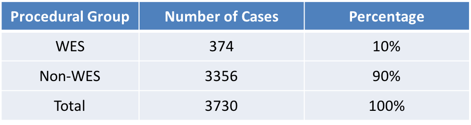
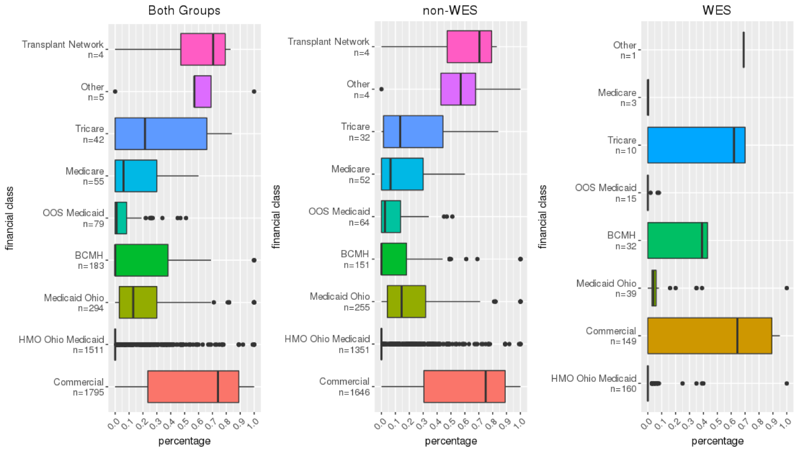
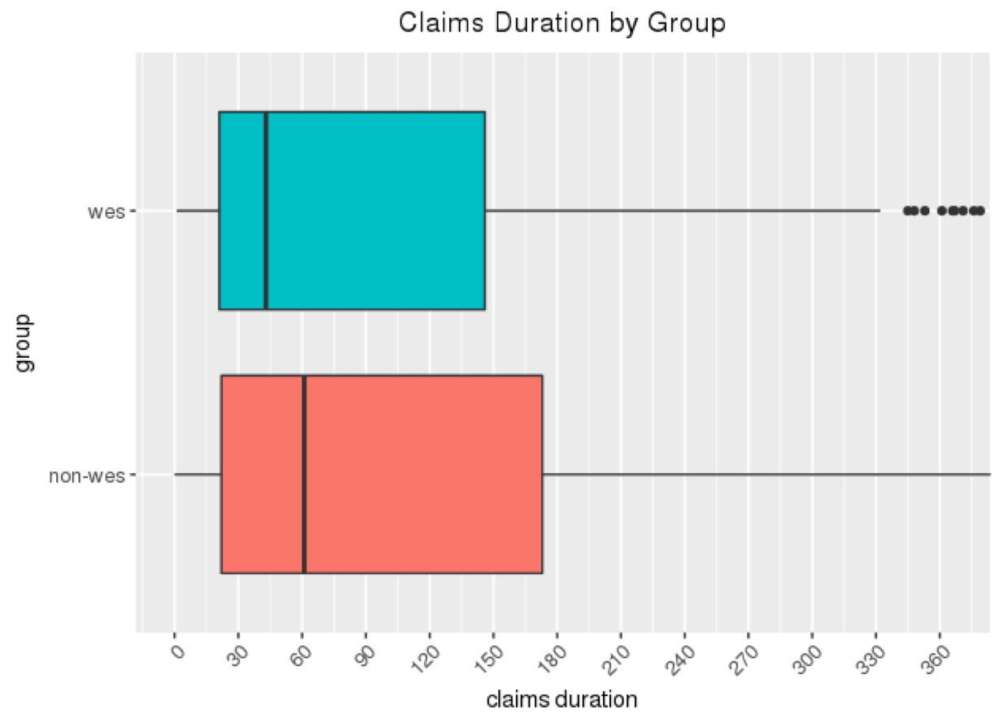

# Analyze the Financial Impact of Different Gene Testing Methods (Whole Exome Sequencing vs Panel Gene Testing) 
Analyze the financial impact of various gene testing method using data visualization and statistical tests to compare means

## Experiment Setup:  
1. contrast groups: Panel Testing vs EXOME SEQUENCE ANALYSIS
2. target variables: charge (A), payment (B), denial rate (C), remit code (D), claims duration (E)
3. covariates: financial class, DX, CCS categories
4. unit of analysis: patient level (A-C) and account level (D, E)

## Statistic Methods:
1. boxplots to show variability between and within groups
2. test pairwise difference between two groups (Pairwise Wilcoxon Rank Sum Test, or P-W Test)
3. test overall difference among multiple groups (Kruskal-Wallis Rank Sum Test, or K-W Test )

## Example Results 
### Case Distribution 

### Percentage of Payment by Financial Class 

Percentage of payment is overall significantly different among different financial classes based on Kruskal-Wallis Test.
### Claims Duration 

In relation to the relatively high denial rate of WES claims, shorter WES claims duration may suggest WES claims could simply be getting denied due to non-coverage. 
